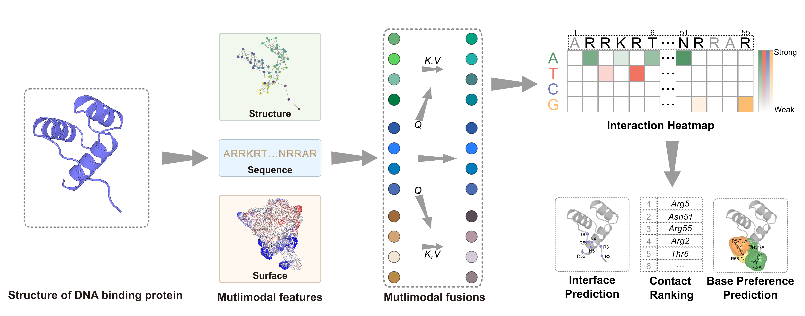

# 3M-BSIP



3M-BSIP is a multimodal deep learning framework for DNA-binding protein specificity prediction. Given a protein structure, the model predicts residue-level DNA-binding interface, nucleotide preference, and residue-importance scores.

## Publication

Please cite the following article when using 3M-BSIP or the ntM modelling module:

> Li, S.; He, W.; Zhang, M.; Zhang, X.; Fang, W.-Q.; Xu, M.-J.; Shi, Y.; Cai, Y.; Zhang, Y.; Da, L.-T. Prediction of Residue-Level Base Preference for DNA-Binding Proteins Using a Multimodal Learning Framework. *JACS Au* (2026). https://doi.org/10.1021/jacsau.6c00925

## Repository structure

```text
.
├── train_amp.py                  # Training entry point
├── evaluate.py                   # Evaluation entry point
├── infer.py                      # Single-structure inference
├── src/                          # Data processing, model and metrics
├── ntm/                          # ntM DNA structure modelling
└── environment.yml
```

## Installation

Create the main environment from `environment.yml`:

```bash
conda env create -f environment.yml
conda activate 3M-BSIP
```

The model uses [SaProt](https://github.com/westlake-repl/SaProt) for structure-aware protein sequence representations. Download the required SaProt checkpoint and place the files under `models/saprot/`.

## Pre-trained weights

Download the released 3M-BSIP checkpoint and ntM template from the [Google Drive](https://drive.google.com/drive/folders/1Ksw99yAFl06esWjPxvO2aNWZItcihz-D?usp=drive_link). Place `best_model.pt` in `checkpoints/` and extract the ntM template into `ntm_templates/`.

```text
checkpoints/best_model.pt
```

## Inference

```bash
python infer.py \
  --input_pdb path/to/input.pdb \
  --checkpoint_path checkpoints/best_model.pt \
  --output_dir results \
  --cache_dir feature_cache/infer_feature_cache
```

The output includes residue-level predictions and visualizations. The input structure may be experimentally determined or computationally predicted.

## Training and evaluation

```bash
python train_amp.py \
  --train_dir Dataset/train \
  --valid_dir Dataset/valid \
  --save_dir checkpoints \
  --log_dir logs/training_logs \
  --gpu_id 0

python evaluate.py \
  --test_dir Dataset/test \
  --checkpoint_path checkpoints/best_model.pt \
  --cache_dir feature_cache
```

## ntM DNA modelling


```bash
python -m ntm.cli \
  --target path/to/protein.pdb \
  --templates /path/to/ntm_templates/ \
  --interface interface.csv \
  --pred pred_nt.csv \
  --outdir output
```
